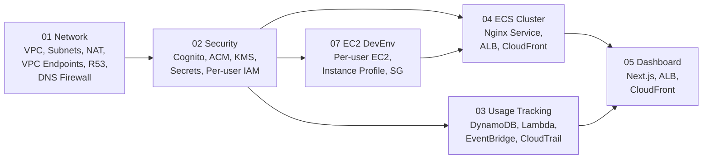
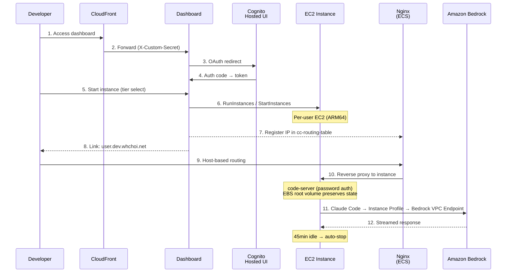
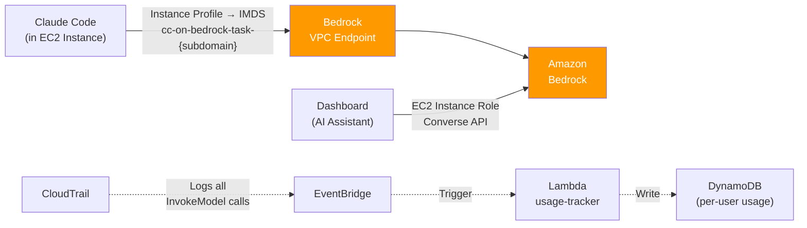
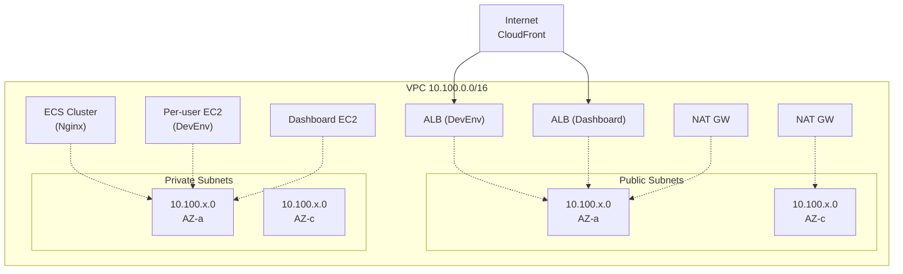
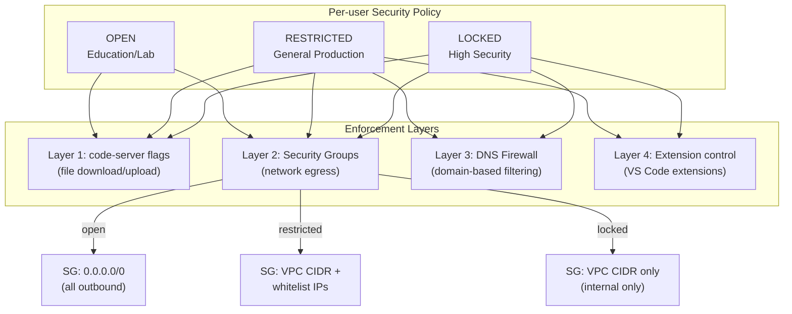
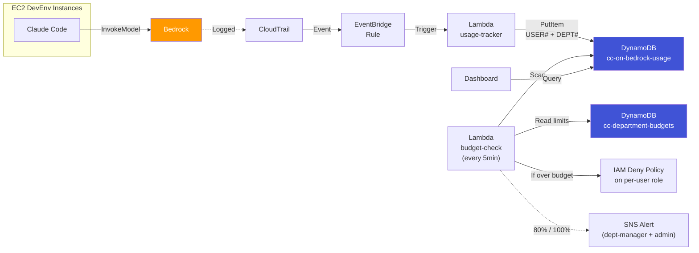

# CC-on-Bedrock Architecture

## Full Architecture Diagram

```mermaid
graph TB
    subgraph Users["Users (Browser)"]
        AdminUser["Admin User"]
        DevUser["Developer User"]
    end

    subgraph CloudFront["CloudFront Distributions"]
        CF_Dashboard["CloudFront<br/>cconbedrock-dashboard.whchoi.net"]
        CF_DevEnv["CloudFront<br/>*.dev.whchoi.net"]
    end

    subgraph Stack01["Stack 01: Network"]
        VPC["VPC 10.100.0.0/16"]
        subgraph PublicSubnets["Public Subnets (2 AZ)"]
            PubA["Public Subnet A"]
            PubC["Public Subnet C"]
        end
        subgraph PrivateSubnets["Private Subnets (2 AZ)"]
            PriA["Private Subnet A"]
            PriC["Private Subnet C"]
        end
        NAT_A["NAT GW A"]
        NAT_C["NAT GW C"]
        VPCE["VPC Endpoints<br/>SSM, ECR, Bedrock,<br/>CloudWatch, S3"]
        R53["Route 53<br/>Hosted Zone"]
        DNSFirewall["DNS Firewall<br/>Threat Lists + Custom"]
    end

    subgraph Stack02["Stack 02: Security"]
        Cognito["Cognito User Pool<br/>+ Hosted UI<br/>(cc-on-bedrock)"]
        ACM["ACM Certificates<br/>*.whchoi.net"]
        KMS["KMS<br/>Encryption Keys"]
        Secrets["Secrets Manager<br/>NextAuth, CloudFront Secret"]
        IAM["IAM Roles<br/>Per-user Task Role,<br/>Permission Boundary,<br/>Dashboard EC2"]
    end

    subgraph Stack03["Stack 03: Usage Tracking"]
        DDB["DynamoDB<br/>cc-on-bedrock-usage"]
        Lambda1["Lambda<br/>bedrock-usage-tracker"]
        Lambda2["Lambda<br/>budget-check (5min)"]
        EB["EventBridge Rules<br/>CloudTrail → Lambda"]
        CT["CloudTrail<br/>Bedrock API Logs"]
    end

    subgraph Stack04["Stack 04: ECS Cluster"]
        DevEnv_ALB["ALB<br/>Host-based Routing"]
        ECS_Cluster["ECS Cluster<br/>EC2 Mode"]
        Nginx["Nginx Service<br/>Reverse Proxy"]
        DevEnv_SGs["Security Groups<br/>open / restricted / locked"]
    end

    subgraph Stack05["Stack 05: Dashboard"]
        Dash_ALB["ALB"]
        Dash_ASG["EC2 ASG<br/>t4g.xlarge"]
        NextJS["Next.js Standalone<br/>PM2 + S3 Deploy"]
    end

    subgraph Stack07["Stack 07: EC2 DevEnv (ADR-004)"]
        EC2_Instances["Per-user EC2<br/>ARM64 (t4g.medium~large)"]
        EC2_EBS["EBS Root Volume<br/>(state preserved on Stop)"]
        EC2_Profile["Per-user Instance Profile<br/>cc-on-bedrock-task-{subdomain}"]
        RoutingTable["DynamoDB<br/>cc-routing-table"]
    end

    subgraph AWS_Services["AWS Services"]
        Bedrock["Amazon Bedrock<br/>Opus 4.6 / Sonnet 4.6"]
        Bedrock_VPCE["Bedrock<br/>VPC Endpoint"]
        ECR["Amazon ECR<br/>devenv images"]
        CW["CloudWatch<br/>CloudWatch Agent"]
    end

    %% User Access Flow
    AdminUser -->|HTTPS| CF_Dashboard
    DevUser -->|HTTPS| CF_Dashboard
    DevUser -->|HTTPS| CF_DevEnv

    %% CloudFront to ALB
    CF_Dashboard -->|X-Custom-Secret| Dash_ALB
    CF_DevEnv -->|X-Custom-Secret| DevEnv_ALB

    %% Dashboard Flow
    Dash_ALB --> Dash_ASG
    Dash_ASG --> NextJS
    NextJS -->|Cognito Admin API| Cognito
    NextJS -->|EC2 Start/Stop| EC2_Instances
    NextJS -->|DynamoDB Query| DDB
    NextJS -->|Bedrock Converse API| Bedrock

    %% Dev Environment Flow (EC2 → Bedrock Direct)
    DevEnv_ALB -->|Host: user.dev.*| Nginx
    Nginx -->|Reverse Proxy| EC2_Instances
    EC2_Instances --> EC2_EBS
    EC2_Instances -->|Instance Profile → IMDS| Bedrock_VPCE
    Bedrock_VPCE --> Bedrock

    %% Routing
    Nginx -->|Lookup| RoutingTable
    NextJS -->|Register IP| RoutingTable

    %% Usage Tracking Flow
    EC2_Instances -.->|API Call| CT
    CT -->|Event| EB
    EB -->|Trigger| Lambda1
    Lambda1 -->|Write| DDB
    Lambda2 -->|Read/Check| DDB

    %% ECS Cluster (Nginx only)
    ECS_Cluster --> Nginx

    %% Infrastructure
    EC2_Instances --> CW
    NextJS --> CW

    %% DNS
    R53 -->|CNAME| CF_Dashboard
    R53 -->|Wildcard| CF_DevEnv

    %% Network placement
    Dash_ALB -.-> PubA
    DevEnv_ALB -.-> PubA
    Dash_ASG -.-> PriA
    ECS_Cluster -.-> PriA
    EC2_Instances -.-> PriA

    %% Styles
    classDef stack fill:#f9f,stroke:#333,stroke-width:2px
    classDef aws fill:#ff9900,stroke:#333,color:#fff
    classDef user fill:#4a90d9,stroke:#333,color:#fff
    class Stack01,Stack02,Stack03,Stack04,Stack05,Stack07 stack
    class Bedrock,Bedrock_VPCE,ECR,CW aws
    class AdminUser,DevUser user
```

## Stack Dependencies

## User Access Flow

## Bedrock Access (Direct Mode)

## Network Layout

## DLP Security Policies

> See [ADR-005](decisions/ADR-005-security-policy-access-control.md) for the full decision record (DLP + IAM Policy Set + approval workflow).

## IAM Policy Set & Approval Workflow (Proposed)

> Designed but not yet implemented. See [ADR-005](decisions/ADR-005-security-policy-access-control.md).

- **Per-user IAM Role**: `cc-on-bedrock-task-{subdomain}` — Permission Boundary로 최대 권한 범위 제한
- **Pre-defined Policy Set Catalog**: DynamoDB, S3, EKS, SQS, SNS, Secrets Manager 등 8종
- **Approval Workflow**: User 신청 → DynamoDB `cc-approval-requests` → Admin 승인 → 자동 적용
  - `tier_change`: Cognito attribute + EC2 instance type 변경
  - `dlp_change`: Cognito attribute + Security Group swap (실행 중 즉시 적용)
  - `iam_extension`: `PutRolePolicy` on per-user role + EventBridge 기반 자동 만료

## Usage Tracking & Budget Enforcement

> See [ADR-006](decisions/ADR-006-department-budget-management.md) for department budget management decision.

