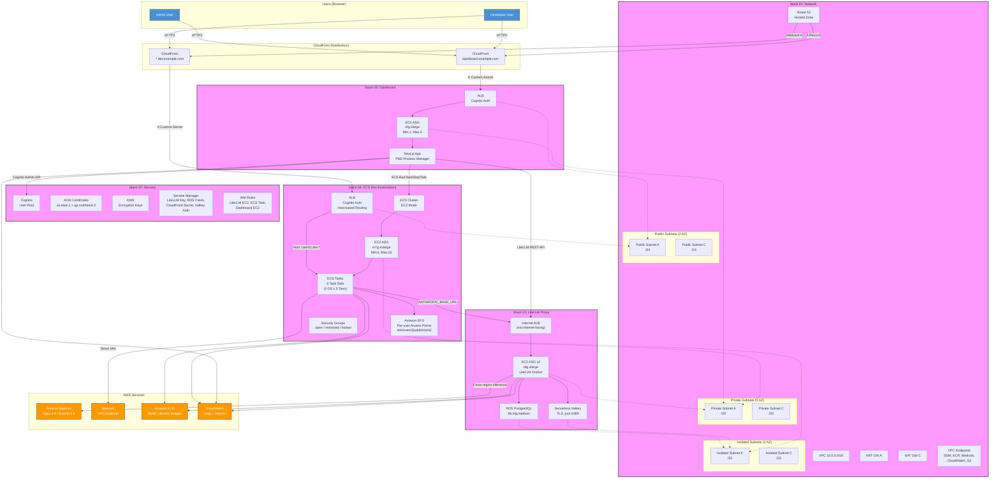
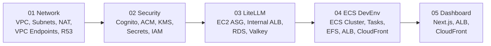
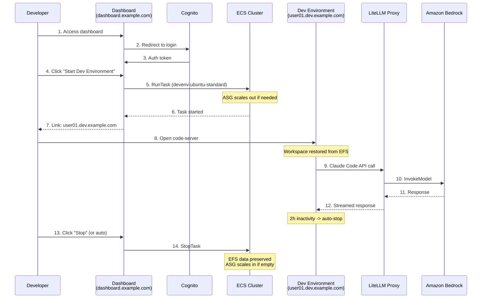
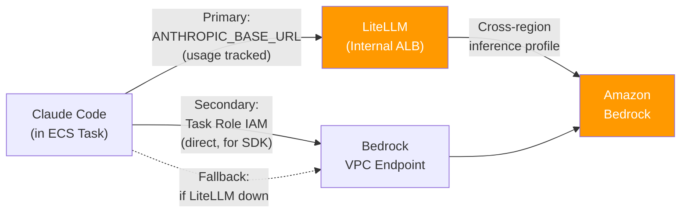
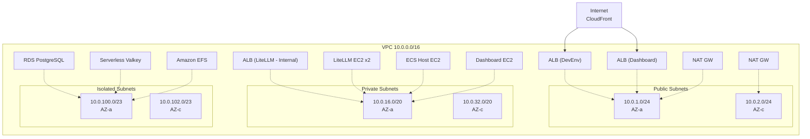
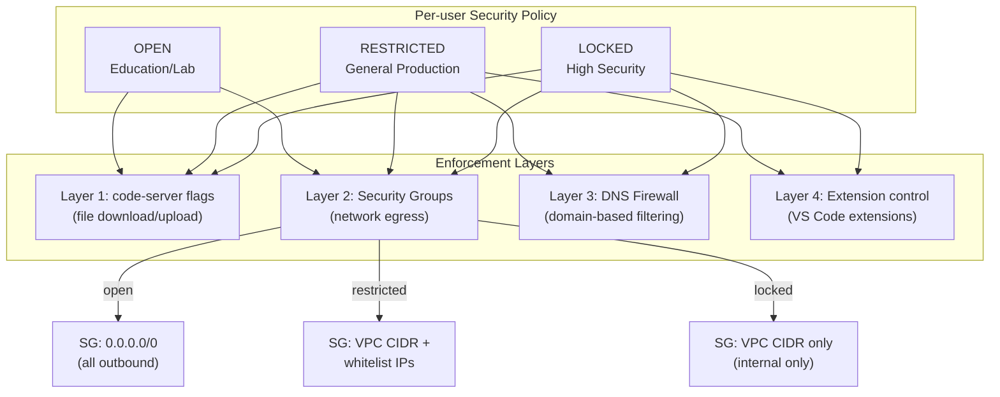

# CC-on-Bedrock Architecture

## Full Architecture Diagram

```mermaid
graph TB
    subgraph Users["Users (Browser)"]
        AdminUser["Admin User"]
        DevUser["Developer User"]
    end

    subgraph CloudFront["CloudFront Distributions"]
        CF_Dashboard["CloudFront<br/>dashboard.example.com"]
        CF_DevEnv["CloudFront<br/>*.dev.example.com"]
    end

    subgraph Stack01["Stack 01: Network"]
        VPC["VPC 10.0.0.0/16"]
        subgraph PublicSubnets["Public Subnets (2 AZ)"]
            PubA["Public Subnet A<br/>/24"]
            PubC["Public Subnet C<br/>/24"]
        end
        subgraph PrivateSubnets["Private Subnets (2 AZ)"]
            PriA["Private Subnet A<br/>/20"]
            PriC["Private Subnet C<br/>/20"]
        end
        subgraph IsolatedSubnets["Isolated Subnets (2 AZ)"]
            IsoA["Isolated Subnet A<br/>/23"]
            IsoC["Isolated Subnet C<br/>/23"]
        end
        NAT_A["NAT GW A"]
        NAT_C["NAT GW C"]
        VPCE["VPC Endpoints<br/>SSM, ECR, Bedrock,<br/>CloudWatch, S3"]
        R53["Route 53<br/>Hosted Zone"]
    end

    subgraph Stack02["Stack 02: Security"]
        Cognito["Cognito<br/>User Pool"]
        ACM["ACM Certificates<br/>us-east-1 + ap-northeast-2"]
        KMS["KMS<br/>Encryption Keys"]
        Secrets["Secrets Manager<br/>LiteLLM Key, RDS Creds,<br/>CloudFront Secret, Valkey Auth"]
        IAM["IAM Roles<br/>LiteLLM EC2, ECS Task,<br/>Dashboard EC2"]
    end

    subgraph Stack03["Stack 03: LiteLLM Proxy"]
        LiteLLM_ALB["Internal ALB<br/>(not internet-facing)"]
        LiteLLM_ASG["EC2 ASG x2<br/>t4g.xlarge<br/>LiteLLM Docker"]
        RDS["RDS PostgreSQL<br/>db.t4g.medium"]
        Valkey["Serverless Valkey<br/>TLS, port 6380"]
    end

    subgraph Stack04["Stack 04: ECS Dev Environment"]
        DevEnv_ALB["ALB<br/>Cognito Auth<br/>Host-based Routing"]
        ECS_Cluster["ECS Cluster<br/>EC2 Mode"]
        ECS_ASG["EC2 ASG<br/>m7g.4xlarge<br/>Min:0, Max:15"]
        Tasks["ECS Tasks<br/>6 Task Defs<br/>(2 OS x 3 Tiers)"]
        EFS["Amazon EFS<br/>Per-user Access Points<br/>/efs/users/{subdomain}/"]
        DevEnv_SGs["Security Groups<br/>open / restricted / locked"]
    end

    subgraph Stack05["Stack 05: Dashboard"]
        Dash_ALB["ALB<br/>Cognito Auth"]
        Dash_ASG["EC2 ASG<br/>t4g.xlarge<br/>Min:1, Max:2"]
        NextJS["Next.js App<br/>PM2 Process Manager"]
    end

    subgraph AWS_Services["AWS Services"]
        Bedrock["Amazon Bedrock<br/>Opus 4.6 / Sonnet 4.6"]
        Bedrock_VPCE["Bedrock<br/>VPC Endpoint"]
        ECR["Amazon ECR<br/>litellm / devenv images"]
        CW["CloudWatch<br/>Logs + Alarms"]
    end

    %% User Access Flow
    AdminUser -->|HTTPS| CF_Dashboard
    DevUser -->|HTTPS| CF_Dashboard
    DevUser -->|HTTPS| CF_DevEnv

    %% CloudFront to ALB
    CF_Dashboard -->|X-Custom-Secret| Dash_ALB
    CF_DevEnv -->|X-Custom-Secret| DevEnv_ALB

    %% Dashboard Flow
    Dash_ALB --> Dash_ASG
    Dash_ASG --> NextJS
    NextJS -->|Cognito Admin API| Cognito
    NextJS -->|ECS RunTask/StopTask| ECS_Cluster
    NextJS -->|LiteLLM REST API| LiteLLM_ALB

    %% Dev Environment Flow
    DevEnv_ALB -->|Host: user01.dev.*| Tasks
    Tasks --> EFS
    Tasks -->|ANTHROPIC_BASE_URL| LiteLLM_ALB
    Tasks -->|Direct IAM| Bedrock_VPCE

    %% LiteLLM Flow
    LiteLLM_ALB --> LiteLLM_ASG
    LiteLLM_ASG -->|Cross-region inference| Bedrock
    LiteLLM_ASG --> RDS
    LiteLLM_ASG --> Valkey

    %% ECS Cluster
    ECS_Cluster --> ECS_ASG
    ECS_ASG --> Tasks

    %% Infrastructure
    LiteLLM_ASG --> ECR
    Tasks --> ECR
    LiteLLM_ASG --> CW
    Tasks --> CW
    NextJS --> CW

    %% DNS
    R53 -->|A Record| CF_Dashboard
    R53 -->|Wildcard A| CF_DevEnv

    %% Network placement
    Dash_ALB -.-> PubA
    DevEnv_ALB -.-> PubA
    LiteLLM_ASG -.-> PriA
    Dash_ASG -.-> PriA
    ECS_ASG -.-> PriA
    RDS -.-> IsoA
    Valkey -.-> IsoA
    EFS -.-> IsoA

    %% Styles
    classDef stack fill:#f9f,stroke:#333,stroke-width:2px
    classDef aws fill:#ff9900,stroke:#333,color:#fff
    classDef user fill:#4a90d9,stroke:#333,color:#fff
    class Stack01,Stack02,Stack03,Stack04,Stack05 stack
    class Bedrock,Bedrock_VPCE,ECR,CW aws
    class AdminUser,DevUser user
```

## Stack Dependencies

```mermaid
graph LR
    S1["01 Network<br/>VPC, Subnets, NAT,<br/>VPC Endpoints, R53"] --> S2["02 Security<br/>Cognito, ACM, KMS,<br/>Secrets, IAM"]
    S2 --> S3["03 LiteLLM<br/>EC2 ASG, Internal ALB,<br/>RDS, Valkey"]
    S3 --> S4["04 ECS DevEnv<br/>ECS Cluster, Tasks,<br/>EFS, ALB, CloudFront"]
    S4 --> S5["05 Dashboard<br/>Next.js, ALB,<br/>CloudFront"]
```

## User Access Flow

```mermaid
sequenceDiagram
    participant User as Developer
    participant Dash as Dashboard<br/>(dashboard.example.com)
    participant Cognito as Cognito
    participant ECS as ECS Cluster
    participant DevEnv as Dev Environment<br/>(user01.dev.example.com)
    participant LiteLLM as LiteLLM Proxy
    participant Bedrock as Amazon Bedrock

    User->>Dash: 1. Access dashboard
    Dash->>Cognito: 2. Redirect to login
    Cognito->>Dash: 3. Auth token
    User->>Dash: 4. Click "Start Dev Environment"
    Dash->>ECS: 5. RunTask (devenv-ubuntu-standard)
    Note over ECS: ASG scales out if needed
    ECS-->>Dash: 6. Task started
    Dash-->>User: 7. Link: user01.dev.example.com
    User->>DevEnv: 8. Open code-server
    Note over DevEnv: Workspace restored from EFS
    DevEnv->>LiteLLM: 9. Claude Code API call
    LiteLLM->>Bedrock: 10. InvokeModel
    Bedrock-->>LiteLLM: 11. Response
    LiteLLM-->>DevEnv: 12. Streamed response
    Note over DevEnv: 2h inactivity -> auto-stop
    User->>Dash: 13. Click "Stop" (or auto)
    Dash->>ECS: 14. StopTask
    Note over ECS: EFS data preserved<br/>ASG scales in if empty
```

## Bedrock Access Paths

```mermaid
graph LR
    CC["Claude Code<br/>(in ECS Task)"] -->|"Primary:<br/>ANTHROPIC_BASE_URL<br/>(usage tracked)"| LiteLLM["LiteLLM<br/>(Internal ALB)"]
    LiteLLM -->|"Cross-region<br/>inference profile"| Bedrock["Amazon<br/>Bedrock"]

    CC -->|"Secondary:<br/>Task Role IAM<br/>(direct, for SDK)"| VPCE["Bedrock<br/>VPC Endpoint"]
    VPCE --> Bedrock

    CC -.->|"Fallback:<br/>if LiteLLM down"| VPCE

    style LiteLLM fill:#ff9900,color:#fff
    style Bedrock fill:#ff9900,color:#fff
```

## Network Layout

```mermaid
graph TB
    subgraph VPC["VPC 10.0.0.0/16"]
        subgraph PubSub["Public Subnets"]
            direction LR
            PS_A["10.0.1.0/24<br/>AZ-a"]
            PS_C["10.0.2.0/24<br/>AZ-c"]
        end

        subgraph PriSub["Private Subnets"]
            direction LR
            PR_A["10.0.16.0/20<br/>AZ-a"]
            PR_C["10.0.32.0/20<br/>AZ-c"]
        end

        subgraph IsoSub["Isolated Subnets"]
            direction LR
            IS_A["10.0.100.0/23<br/>AZ-a"]
            IS_C["10.0.102.0/23<br/>AZ-c"]
        end

        ALB1["ALB (DevEnv)"]
        ALB2["ALB (Dashboard)"]
        ALB3["ALB (LiteLLM - Internal)"]
        NAT1["NAT GW"]
        NAT2["NAT GW"]

        LiteLLM_EC2["LiteLLM EC2 x2"]
        ECS_EC2["ECS Host EC2"]
        Dash_EC2["Dashboard EC2"]

        RDS_DB["RDS PostgreSQL"]
        Valkey_DB["Serverless Valkey"]
        EFS_FS["Amazon EFS"]

        ALB1 -.-> PS_A
        ALB2 -.-> PS_A
        NAT1 -.-> PS_A
        NAT2 -.-> PS_C

        ALB3 -.-> PR_A
        LiteLLM_EC2 -.-> PR_A
        ECS_EC2 -.-> PR_A
        Dash_EC2 -.-> PR_A

        RDS_DB -.-> IS_A
        Valkey_DB -.-> IS_A
        EFS_FS -.-> IS_A
    end

    Internet["Internet<br/>CloudFront"] --> ALB1
    Internet --> ALB2
```

## DLP Security Policies

```mermaid
graph TD
    subgraph Policies["Per-user Security Policy"]
        Open["OPEN<br/>Education/Lab"]
        Restricted["RESTRICTED<br/>General Production"]
        Locked["LOCKED<br/>High Security"]
    end

    subgraph Layers["Enforcement Layers"]
        L1["Layer 1: code-server flags<br/>(file download/upload)"]
        L2["Layer 2: Security Groups<br/>(network egress)"]
        L3["Layer 3: DNS Firewall<br/>(domain-based filtering)"]
        L4["Layer 4: Extension control<br/>(VS Code extensions)"]
    end

    Open --> L1
    Open --> L2
    Restricted --> L1
    Restricted --> L2
    Restricted --> L3
    Restricted --> L4
    Locked --> L1
    Locked --> L2
    Locked --> L3
    Locked --> L4

    L2 -->|open| SG1["SG: 0.0.0.0/0<br/>(all outbound)"]
    L2 -->|restricted| SG2["SG: VPC CIDR +<br/>whitelist IPs"]
    L2 -->|locked| SG3["SG: VPC CIDR only<br/>(internal only)"]
```
