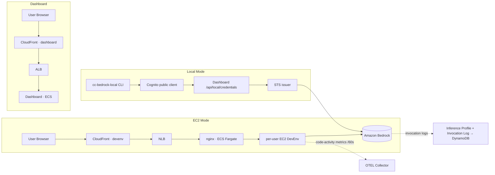

# CC-on-Bedrock — Architecture (SSOT)

> **SINGLE SOURCE OF TRUTH for the CURRENT architecture. Read this FIRST.**
> ADRs in `docs/decisions/` are the *decision log* (why a choice was made), not the
> current-state reference. Anything under `docs/decisions/archive/` is **historical /
> superseded — NOT current**; never treat it as the present design.
> Last reconciled: 2026-06-21 (after the CDK→Terraform migration).

## What this is
멀티유저 Claude Code 개발환경 플랫폼 on AWS Bedrock. 사용자는 per-user EC2 DevEnv(브라우저 IDE)
또는 로컬 PC에서 Bedrock을 호출하고, 사용량·예산·IAM 권한이 중앙에서 거버넌스된다.

## Access paths


```mermaid
graph LR
  subgraph EC2 Mode
    U1[User Browser] --> CFd[CloudFront · devenv] --> NLB --> NG[nginx · ECS Fargate] --> EC2[per-user EC2 DevEnv]
    EC2 --> BR[(Amazon Bedrock)]
  end
  subgraph Dashboard
    U2[User Browser] --> CFa[CloudFront · dashboard] --> ALB --> DASH[Dashboard · ECS]
  end
  subgraph Local Mode
    L[cc-bedrock-local CLI] --> CG[Cognito public client] --> API[Dashboard /api/local/credentials] --> STS[STS issuer] --> BR
  end
  EC2 -. code-activity metrics /60s .-> OT[OTEL Collector]
  BR -. invocation logs .-> AGG[Inference Profile + Invocation Log → DynamoDB]
```

> Two CloudFront distributions (separated by concern): one for the devenv path, one for the
> dashboard (devenv fronts an NLB, dashboard fronts an ALB).

## Canonical decisions (the 9 pillars)

1. **Tools on Bedrock.** Claude Code on Bedrock is the first implementation target; Codex on
   Bedrock is a later extension. Kiro is installed by default but uses IAM Identity Center
   subscription licensing — it does **not** participate in Cognito/Bedrock usage governance.
2. **Two access paths.**
   - **EC2 Mode:** CloudFront → NLB → nginx (ECS Fargate) → per-user EC2 DevEnv.
   - **Local Mode:** `cc-bedrock-local` → Cognito public client → Dashboard
     `/api/local/credentials` → STS issuer.
3. **Code-activity OTEL.** EC2 DevEnv pushes code-activity metrics to the OTEL Collector every
   60 seconds.
4. **Usage metering.** Bedrock **Application Inference Profiles** + **Bedrock Invocation Logs**
   are aggregated into **DynamoDB** (not CloudWatch AWS/Bedrock account-wide metrics).
5. **Shared credential model.** EC2 and Local mode attribute usage through the **same Application
   Inference Profile**. They do **not** share one literal IAM role — they share policy shape,
   permission boundary, tags, and inference-profile attribution.
6. **DevEnv compute & storage.** Per-user EC2; OS = **Ubuntu** or **Amazon Linux 2023**; storage =
   **EBS GP3** root volume with **`DeleteOnTermination=false`** (the root volume *is* the
   persistence — a Terminate must not destroy user state). Idle instances **Stop/Hibernate**
   (hibernation enabled; encrypted root; idle-stop + hibernate-expiry schedules) and resume with
   state intact.
7. **Self-service IAM.** A UI lets users request additional IAM permissions; requests require
   **admin approval** and are bounded by a permission boundary.
8. **Budget enforcement.** Per-department and per-user budgets/limits; **EventBridge** drives IAM
   deny-policy updates to enforce them.
9. **Path/port routing.** code-server is reached by path (`?folder=`) and stays on port **8080**
   (reserved). Additional user ports are exposed by mapping path→port; nginx connects them.
   Custom route ports must **not** use 8080 (or other reserved/well-known ports).

## IaC
- **Terraform is the only active IaC surface.** CDK and CloudFormation are **not** canonical and
  must not be extended.
- Lambda handlers live in `lambda/` (not under any IaC dir) so Terraform packages them directly.

## Key paths
```text
terraform/          Terraform root and modules (canonical IaC)
lambda/             Lambda source
shared/nextjs-app/  Dashboard (Next.js)
tools/              CLI + operational scripts (cc-bedrock-local.sh, cc-otel-code-metrics.sh)
docker/nginx/       Shared nginx router image
docs/decisions/     ADR decision log (active)  ·  docs/decisions/archive/ = historical
```

## Hard rules (invariants)
- Do not add new CDK or CloudFormation deployment paths.
- Do not place Lambda source under an IaC directory.
- Do not use one literal IAM role for both EC2 and Local mode.
- Do not extend chained STS credentials beyond one hour — use `credential_process` renewal.
- Keep Kiro out of Cognito and Bedrock token-limit enforcement.
- Keep port 8080 reserved for code-server; custom route ports must not use it.

## Where decisions live
- **Current truth:** this file.
- **Why (decision log):** `docs/decisions/ADR-*.md` (active set). Superseded ADRs move to
  `docs/decisions/archive/` and are not current.
- **How (runbooks/specs):** `docs/runbooks/`, `docs/superpowers/specs/`.
