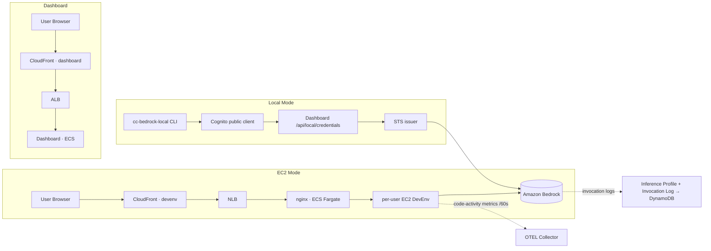

# CC-on-Bedrock — Architecture (SSOT)

> **SINGLE SOURCE OF TRUTH for the CURRENT architecture. Read this FIRST.**
> ADRs in `docs/decisions/` are the *decision log* (why); the decision baseline is
> `docs/decisions/BASELINE.md`. Anything under `docs/decisions/archive/` or `docs/history/`
> is **historical / superseded — NOT current**.
> Last reconciled: 2026-06-23 (Terraform-only; CDK/CFN removed).

## What this is
멀티유저 Claude Code 개발환경 플랫폼 on AWS Bedrock. 사용자는 per-user EC2 DevEnv(브라우저 IDE)
또는 로컬 PC에서 Bedrock을 호출하고, 사용량·예산·IAM 권한이 중앙에서 거버넌스된다.

## Access paths


```mermaid
graph LR
  subgraph EC2 Mode
    U1[User Browser] --> CFd[CloudFront · devenv] --> NLB --> NG[nginx · ECS Fargate] --> EC2[per-user EC2 DevEnv]
    EC2 --> BR[(Amazon Bedrock)]
  end
  subgraph Dashboard
    U2[User Browser] --> CFa[CloudFront · dashboard] --> ALB --> DASH[Dashboard · ECS]
  end
  subgraph Local Mode
    L[cc-bedrock-local CLI] --> CG[Cognito public client] --> API[Dashboard /api/local/credentials] --> STS[STS issuer] --> BR
  end
  EC2 -. code-activity metrics /60s .-> OT[OTEL Collector]
  BR -. invocation logs .-> AGG[Inference Profile + Invocation Log → DynamoDB]
```

> 2 CloudFront distributions (ADR-016): devenv(→NLB→nginx) and dashboard(→ALB), 분리.

## Canonical decisions (the 9 pillars)

1. **Tools on Bedrock.** Claude Code on Bedrock is the first target; Codex on Bedrock is a later
   extension. Kiro is installed by default but uses IAM Identity Center licensing — **not** part of
   Cognito/Bedrock usage governance.
2. **Two access paths.** EC2 Mode (CloudFront→NLB→nginx ECS→EC2) + Local Mode (`cc-bedrock-local`
   → Cognito public client → Dashboard `/api/local/credentials` → STS issuer).
3. **Code-activity OTEL.** EC2 DevEnv pushes code-activity metrics to the OTEL Collector every 60s.
4. **Usage metering.** Bedrock **Application Inference Profiles** + **Invocation Logs** → **DynamoDB**
   (not CloudWatch AWS/Bedrock account-wide metrics).
5. **Shared credential model.** EC2 and Local attribute usage through the **same Application Inference
   Profile**; they do **not** share one literal IAM role (share policy shape, permission boundary,
   tags, inference-profile attribution).
6. **DevEnv compute & storage.** Per-user EC2; OS = **Ubuntu** or **Amazon Linux 2023**. **2-volume
   model (ADR-032):** ephemeral OS root EBS (`DeleteOnTermination=true`, replaceable via new AMI) +
   **persistent data EBS** for `/home/coder` (GP3, `DeleteOnTermination=false`, subdomain-tagged,
   reattached across rebuild/OS-switch). Idle instances Stop/Hibernate and resume with state intact.
7. **Self-service IAM.** UI requests for extra IAM permissions require **admin approval**, bounded by
   a permission boundary authored in Terraform (boundary X = AllowInAccount; the DenyEscalation
   63-action floor's full TF port is a **follow-up** tracked by ADR-007/ADR-034 — not yet complete).
8. **Budget enforcement.** Per-department and per-user budgets/limits ($ + normalized token);
   **EventBridge** drives IAM deny-policy updates.
9. **Path/port routing.** code-server reached by path (`?folder=`), stays on port **8080** (reserved);
   extra user ports mapped path→port via nginx. Custom ports must not use 8080/well-known.

## IaC
- **Terraform is the only IaC.** CDK/CloudFormation removed (ADR-033). Lambda handlers in `lambda/`
  (Terraform packages them). Policies incl. permission boundary authored in Terraform (ADR-034).

## Key paths
```text
terraform/          Terraform root and modules (canonical IaC)
lambda/             Lambda source
shared/nextjs-app/  Dashboard (Next.js)
tools/              cc-bedrock-local.sh, cc-otel-code-metrics.sh
docker/nginx/       Shared nginx router image
docs/decisions/     BASELINE.md + active ADRs · archive/ = historical
```

## Hard rules (invariants)
- No new CDK/CloudFormation deployment paths. Lambda source stays in `lambda/`.
- Do not use one literal IAM role for both EC2 and Local mode.
- Do not extend chained STS credentials beyond one hour — use `credential_process` renewal.
- DevEnv data lives on the persistent data EBS, not the OS root (a Terminate must not destroy it).
- Keep port 8080 reserved for code-server.
- Keep Kiro out of Cognito and Bedrock token-limit enforcement.

## Where decisions live
- **Current truth:** this file + `docs/decisions/BASELINE.md`.
- **Why (log):** `docs/decisions/ADR-*.md`; superseded → `docs/decisions/archive/` (not current).
