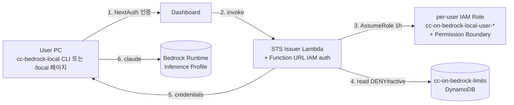

# 아키텍처 (Architecture)

CC-on-Bedrock의 아키텍처는 가용성, 보안, 그리고 개별 사용자 격리에 중점을 두고
설계되었습니다. 24개의 ADR(Architecture Decision Record)로 주요 결정의 근거가
문서화되어 있습니다.

## 인프라 스택 구성

CDK 기준 8개 스택 (Terraform/CloudFormation도 동일 구조). 각 스택은 독립적으로
배포 및 관리할 수 있습니다.

| 스택 | 주요 리소스 | 핵심 ADR |
|---|---|---|
| **01-Network** | VPC (10.100.0.0/16, 2 AZ), NAT, VPC Endpoints, DNS Firewall, Route 53 | — |
| **02-Security** | Cognito User Pool + custom 속성, ACM, KMS, Secrets Manager, IAM 기반 role + Permission Boundary | — |
| **03-Usage Tracking** | DynamoDB usage / cli_tokens / user_budgets / approval_requests / prompt_audit / mcp_catalog / dept_mcp_config 테이블, Lambda (tracker / budget-check / ec2-idle-stop / audit-logger / gateway-manager), Bedrock invocation logging | ADR-011, ADR-019 |
| **04-ECS Dashboard 인프라** | NLB internet-facing, Nginx Fargate (HA), DynamoDB routing table + Lambda nginx-config-gen | ADR-002 |
| **05-Dashboard** | Next.js Standalone ECS task, 통합 CloudFront, Lambda@Edge (session-validator + origin-router) | ADR-013, ADR-016, ADR-017 |
| **06-WAF** | CLOUDFRONT-scope WebACL (`us-east-1`) | — |
| **07-EC2 DevEnv** | Launch Template (ARM64, t4g.large), 3-tier DLP Security Groups (open/restricted/locked), Hibernation | ADR-004, ADR-005, ADR-009, ADR-010, ADR-018 |
| **08-Local Governance** | STS Issuer Lambda + Function URL, `cc-on-bedrock-limits` table, token-limit-enforcer, limit-reset cron, UserRoleProvisioner Lambda + EventBridge `cognito-user-created` rule + DLQ | ADR-014, ADR-015, ADR-021, ADR-022, ADR-024 |

배포 프로파일:
- **기본** (`cdk deploy --all`): 1~8 모두 배포 (EC2 + Local 공존 가능)
- **Governance only** (`cdk deploy --all -c governanceOnly=true`): 7번 스킵 (EC2 DevEnv 미배포)

## EC2-per-user DevEnv 아키텍처 (Stack 07, ADR-004)

각 사용자에게 **전용 EC2 인스턴스 1대**가 할당됩니다 (ECS Task 모델은 ADR-004로
폐기됨):

- **1 EC2 instance** — t4g.large ARM64 (Ubuntu 24.04 또는 AL2023, ADR-018)
- **1 EBS root volume** — 사용자별 데이터 영구 보관 (Stop 시 그대로 유지)
- **1 per-user IAM Instance Profile** — `cc-on-bedrock-task-{subdomain}` (Dashboard API가 RunInstances 직전 생성)
- **1 Nginx 라우팅 entry** — `{subdomain}.dev.{domain}` → DynamoDB routing table → Nginx Fargate가 5초 hot-reload
- **3 DevEnv 포트** — code-server :8080, Frontend :3000, API :8000 (ADR-009)
- **Hibernation 지원** (ADR-010) — `HIBERNATE_ENABLED=true` 시 RAM → 암호화 EBS 저장, ~5초 resume

### 콜드 / 핫 스타트

- **Cold start** — RunInstances + cloud-init: ~30초
- **Hot resume (Hibernation)** — ~5초
- **Idle 시 자동 Stop** — `ec2-idle-stop` Lambda가 CloudWatch 메트릭 기반 판단

## Local Governance Mode 아키텍처 (Stack 08, ADR-014)

EC2를 띄우지 않고 사용자가 본인 PC에서 `claude`를 직접 실행합니다:

자세한 사용법은 [Local Governance Mode](./local-mode.md) 문서를 참고하세요.

## 하이브리드 AI 아키텍처

대시보드(`/ai`)와 외부 채널(Slack)은 서로 다른 경로로 AI 서비스를 호출합니다:

### 대시보드 — 빠른 스트리밍 (`/api/ai`)
- **경로**: Browser → `/api/ai` → Bedrock Converse API (Direct)
- **특징**: 토큰 단위 SSE 스트리밍, 1~5초 응답, 인라인 도구(5개) 지원,
  AgentCore Memory로 세션 격리

### Slack / 외부 채널 — 공유 런타임 (`/api/ai/runtime`)
- **경로**: Slack Bot → `/api/ai/runtime` → AgentCore Runtime → MCP Gateway → Lambda
- **특징**: 전체 처리 후 응답, 10~20초, 8+ 전문 도구 (per-department MCP, ADR-007)

모든 경로는 **AgentCore Memory**를 통해 사용자별 세션과 대화 기록을 공유합니다.

## 인증 / SSO

ADR-013에 따라 Dashboard와 DevEnv가 **하나의 CloudFront 배포 + 단일 NextAuth
JWE 쿠키**로 SSO됩니다:

- 사용자가 Dashboard 로그인 → NextAuth가 JWE 쿠키를 `.{domain}` 도메인에 설정
- DevEnv 서브도메인(`{subdomain}.dev.{domain}`) 접근 시 같은 쿠키로 Lambda@Edge
  session-validator가 검증
- 별도의 Cognito Hosted UI redirect 없이 단일 로그인으로 양쪽 사용 가능

## 더 깊이

세부 사항은 다음 ADR을 참고하세요:

- ADR-004 — EC2-per-user DevEnv 전환
- ADR-007 — Department MCP Gateway
- ADR-010 — EC2 Hibernation
- ADR-011 — Bedrock IAM Cost Allocation
- ADR-013 — Unified CloudFront + Single Auth
- ADR-014 — Local Governance Mode
- ADR-015 — Dollar Budget × Normalized Token Limit
- ADR-019 — Bedrock Model ID Normalization
- ADR-021 — Wildcard Claude IAM
- ADR-022 — EventBridge Pre-Provisioning
- ADR-024 — Cognito Deletion Cleanup

전체 목록은 [docs/decisions/](https://github.com/Atom-oh/cc-on-bedrock/tree/main/docs/decisions)에서 확인하세요.
