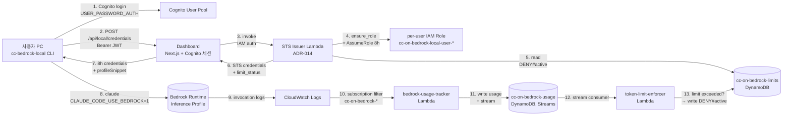

# Local Governance Mode

자신의 노트북/워크스테이션에서 직접 **Claude Code**를 실행하면서도 회사의
거버넌스(예산 한도, IAM 권한 경계, 사용량 추적)는 그대로 적용받는 모드입니다.
EC2-per-user DevEnv를 띄우지 않고 Bedrock만 호출하기 때문에 인프라 비용이
크게 절감됩니다 (ADR-014).

:::tip 언제 사용하나요?
- 본인 PC가 충분히 빠르고 로컬 IDE/터미널 환경에 익숙하다
- 회사 가이드라인(모델 ID, 일/주/월 토큰 한도, 부서 예산)은 따르고 싶다
- EC2 DevEnv 비용을 줄이고 싶다 (Local 모드는 EC2를 띄우지 않음)
:::

---

## 1. 전체 흐름



| 단계 | 주체 | 무엇을 하나 |
|---|---|---|
| 1-2 | User → Cognito → Dashboard | 비밀번호 인증 → JWT 세션 |
| 3-7 | Dashboard → STS Issuer → User | 8시간 짜리 Bedrock 자격증명 발급 |
| 8-9 | User → Bedrock | `claude` CLI가 Bedrock 직접 호출 |
| 10-13 | Bedrock → Tracker → Enforcer | 사용량 집계 → 한도 초과 시 IAM Deny 부착 |

---

## 2. CLI 사용법 (`cc-bedrock-local`)

### 2.1 설치

대시보드의 **`/local`** 페이지에서 직접 다운로드:

```bash
# 한 줄 설치 (Dashboard URL은 본인 환경에 맞게 교체)
curl -fsSL https://cconbedrock-dashboard.<your-domain>/tools/cc-bedrock-local.sh \
  -o ~/.local/bin/cc-bedrock-local
chmod +x ~/.local/bin/cc-bedrock-local

# PATH에 ~/.local/bin 추가 (이미 있으면 생략)
echo 'export PATH="$HOME/.local/bin:$PATH"' >> ~/.bashrc
source ~/.bashrc
```

### 2.2 설정 파일

`~/.config/cc-bedrock/config` (모드 600 권장):

```bash
# 필수
DASHBOARD_URL=https://cconbedrock-dashboard.<your-domain>
COGNITO_REGION=ap-northeast-2
COGNITO_USER_POOL_ID=ap-northeast-2_xxxxxxxxx
COGNITO_CLIENT_ID=xxxxxxxxxxxxxxxxxxxxxxxxxx
EMAIL=you@company.com

# 선택 (기본값 그대로 두면 됨)
AWS_PROFILE_NAME=cc-bedrock          # ~/.aws/credentials 에 쓸 프로파일 이름
AWS_REGION=ap-northeast-2

# 모델 매핑 (Claude Code 의 /model 픽커 슬롯)
# Opus는 최신인 4.7로 두는 것을 권장 (4.6과 단가 동일하지만 reasoning 개선)
ANTHROPIC_DEFAULT_SONNET_MODEL=global.anthropic.claude-sonnet-4-6
ANTHROPIC_DEFAULT_OPUS_MODEL=global.anthropic.claude-opus-4-7
ANTHROPIC_DEFAULT_HAIKU_MODEL=us.anthropic.claude-haiku-4-5-20251001-v1:0
CLAUDE_CODE_SUBAGENT_MODEL=global.anthropic.claude-sonnet-4-6
```

:::tip 사용 가능한 inference profile
| 모델 | Inference Profile ID |
|---|---|
| Claude Opus 4.7 | `global.anthropic.claude-opus-4-7` (최신) |
| Claude Opus 4.6 (1M context) | `global.anthropic.claude-opus-4-6-v1[1m]` |
| Claude Sonnet 4.6 | `global.anthropic.claude-sonnet-4-6` |
| Claude Haiku 4.5 | `us.anthropic.claude-haiku-4-5-20251001-v1:0` |

ADR-021 wildcard IAM 덕분에 새 모델이 추가되면 IAM 변경 없이 위 환경변수만
바꾸면 됩니다.
:::

:::note Cognito 클라이언트 ID 찾는 법
대시보드 `/local` 페이지의 **"CLI helper"** 섹션에 본인 환경에 맞춘 설정
스니펫이 자동 생성되어 표시됩니다. 그대로 복사하세요.
:::

### 2.3 하루 사용 흐름

```bash
# 처음 한 번만: 로그인 (비밀번호 입력 → Cognito 인증)
cc-bedrock-local login

# claude 실행 — 만료 10분 전이면 자동 재발급
cc-bedrock-local claude

# 현재 잔여 시간 + 한도 상태 확인
cc-bedrock-local status

# 작업 끝나면 (선택) 토큰 캐시 삭제
cc-bedrock-local logout
```

### 2.4 서브커맨드 레퍼런스

| 명령 | 동작 |
|---|---|
| `login` | 비밀번호 프롬프트 → Cognito `USER_PASSWORD_AUTH` → 8h STS 발급. refresh token도 저장 |
| `refresh` | 캐시된 refresh token으로 silent 재발급 (만료되면 실패; 그땐 `login`) |
| `logout` | refresh token + state 캐시 삭제 |
| `change-email` | 새 이메일 + 비밀번호 받아서 config에 영속 |
| `status` | 남은 TTL + 활성 Deny / 한도 상태 출력 |
| `claude [args]` | 세션 확보 + 모델 env 주입 후 `claude` 실행 |
| `set-model K=V` | `sonnet`/`opus`/`haiku`/`subagent`/`pin` 별칭으로 모델 ID 교체 |
| `models` | 현재 모델 매핑 + 사용 가능한 추천 ID 출력 |
| `run -- <cmd>` | 자격증명만 확보하고 임의 명령 실행 (예: `run -- aws bedrock list-foundation-models`) |
| `config` | 현재 설정 파일 + 경로 출력 |

### 2.5 모델 교체

```bash
# Opus 4.6 → Opus 4.7 로 슬롯 교체 (최신 reasoning 개선 적용)
cc-bedrock-local set-model opus=global.anthropic.claude-opus-4-7

# Sonnet 슬롯에 Opus 4.7 강제 매핑 (/model 픽커의 Default도 같이 바뀜)
cc-bedrock-local set-model sonnet=global.anthropic.claude-opus-4-7

# 빠른 백그라운드 작업을 Haiku로
cc-bedrock-local set-model haiku=us.anthropic.claude-haiku-4-5-20251001-v1:0

# Subagent 슬롯
cc-bedrock-local set-model subagent=global.anthropic.claude-sonnet-4-6

# 현재 매핑 확인
cc-bedrock-local models
```

ANTHROPIC_MODEL은 일부러 비워두는 것을 권장합니다. 비워두면 Claude Code의
`/model` 픽커에 "Default" / "Sonnet" / "Opus" / "Haiku" 슬롯이 그대로
보여서 IDE 안에서 자유롭게 전환할 수 있습니다.

### 2.6 자격증명 캐시 위치

```text
~/.config/cc-bedrock/
├── config              # 사용자 설정 (mode 600 권장)
├── state.json          # 최근 자격증명 + 한도 상태 (mode 600)
└── cognito-tokens.json # refresh token (mode 600)

~/.aws/credentials      # [cc-bedrock] 프로파일이 자동 쓰여짐
```

---

## 3. Dashboard `/local` 페이지

`cc-bedrock-local`을 깔지 않고 **브라우저에서 직접 자격증명을 가져와도**
됩니다. 대시보드 사이드바에서 **"Local Mode"** → `/local` 경로로 들어갑니다.

### 3.1 첫 로그인

대시보드 진입은 Cognito 인증입니다. 회사 이메일과 비밀번호를 입력하세요.


### 3.2 초기 화면 — 자격증명 발급 전

`/local` 페이지에 처음 들어오면 **Get credentials** 버튼 하나와 현재 사용량
게이지(아직 0)가 보입니다.


화면 구성 요약:

| 섹션 | 내용 |
|---|---|
| **Local Governance Mode** | 페이지 헤더 + 모드 설명 |
| **Get Bedrock credentials** | 8h STS 자격증명 발급 버튼 |
| **Normalized token usage** | DAILY/WEEKLY/MONTHLY 게이지 (본인 + 본인 부서) |
| **CLI helper** | `cc-bedrock-local.sh` 다운로드 + 1회용 설정 스니펫 |
| **Deny 활성 시 (위 화면엔 없음)** | 페이지 최상단 빨간색 배너 — daily/weekly/monthly 한도 초과 시 |

### 3.3 Get credentials 클릭 후 — 발급된 상태

버튼이 **Refresh credentials**로 바뀌고 만료 시각, `~/.aws/credentials`
스니펫, Shell environment 스니펫, 사용된 IAM Role ARN이 펼쳐집니다.


| 표시 | 의미 |
|---|---|
| **Expires** | STS 자격증명 만료 시각 (1h chained-AssumeRole 제한). `Refresh credentials`로 즉시 재발급 |
| **~/.aws/credentials snippet** | `[cc-bedrock]` 프로파일 블록. **Copy**로 클립보드 복사 후 본인 PC `~/.aws/credentials`에 붙여넣기 |
| **Shell environment** | `CLAUDE_CODE_USE_BEDROCK=1` + 모델 env. `.bashrc`나 현재 셸에 export |
| **Role** | 발급에 사용된 per-user IAM Role ARN (`cc-on-bedrock-local-user-<sub>`) |

:::tip 만료 시간이 1시간으로 보여요
AWS role chaining(=한 role이 다른 role을 AssumeRole)은 어떤 설정에도
관계없이 세션을 **최대 1시간**으로 제한합니다. CLI(`cc-bedrock-local`)는
잔여 시간 10분 미만이면 자동으로 `refresh`를 실행하므로 사실상 무중단입니다.
브라우저에서 발급받는 경우 만료 전에 Refresh credentials 버튼을 한 번 더
누르면 됩니다.
:::

### 3.4 동작

- **Get credentials** 버튼 → `/api/local/credentials`(POST) → STS Issuer
  Lambda → 8h 자격증명 + `profileSnippet` 반환. 페이지에서 **Copy** 누르면
  클립보드로 복사됨.
- **Normalized token usage** 게이지 → `/api/local/limits` 조회. 사용자
  본인 + 본인 소속 부서의 daily/weekly/monthly 사용량을 0~100% 게이지로 표시.
  ≥80%는 노랑, ≥95%는 빨강.
- **Deny 활성 시** 페이지 최상단 빨간색 배너가 노출되며 자격증명 발급
  자체는 가능하지만 모델 호출이 IAM Deny에 막힙니다 (잔여 시간 표시).

### 3.5 권한 모델

| 사용자 유형 | `/local` 접근 | `/admin/limits` 접근 | `/admin/tokens` 접근 |
|---|---|---|---|
| 일반 사용자 | ✅ 본인 자격증명 + 본인 사용량 | ❌ | ❌ |
| 부서 관리자 (`dept-manager` group) | ✅ + 부서 합계 보임 | ❌ | ❌ (단, `/dept`에서 부서 뷰는 가능) |
| Admin (`admin` group) | ✅ | ✅ | ✅ |

`NEXT_PUBLIC_LOCAL_MODE_ENABLED=true` 환경변수가 설정된 배포에서만 사이드바에
"Local Mode" 항목이 노출됩니다 (`governanceOnly=true` 또는 EC2 공존 배포).

---

## 4. 토큰 사용량은 어디서 보나요?

| 페이지 | 누가 보나 | 무엇이 보이나 |
|---|---|---|
| `/local` (Local Mode) | 본인 | 본인 + 본인 부서의 daily/weekly/monthly normalized token, Deny 상태 |
| `/user` (User Portal) | 본인 | 일일 토큰 사용량 카드 (EC2 모드 포함) |
| `/dept` (Dept Dashboard) | 부서 관리자 | 부서 멤버별 사용량 분포, 부서 예산 잔액 |
| `/admin/tokens` | Admin | 1d/7d/30d 토큰 차트, top users, 부서별 분해 |
| `/analytics` | Admin | 모델 비율, 비용 트렌드, 리더보드 (Bedrock 호출 패턴 분석) |
| `/monitoring` | Admin | 실시간 세션, Bedrock 호출 그래프 (DynamoDB-backed) |

### 4.1 Admin Token Dashboard (`/admin/tokens`)

기간 셀렉터(1d/7d/30d) + 4개 StatCard(Tokens/Cost/Requests/Users) +
Top users 차트 + 부서별 분해.


데이터 출처: `cc-on-bedrock-usage` DynamoDB (CloudWatch `AWS/Bedrock`
메트릭은 계정 전체이므로 사용 안 함, ADR-019). 프로젝트 IAM role prefix
(`cc-on-bedrock-task-*`, `cc-on-bedrock-local-user-*`)로 3-layer 필터링.

### 4.1b 사용자 본인 포털 (`/user`)

일반 사용자는 자신의 일일/누적 토큰 사용량을 `/user` 포털에서도 봅니다
(EC2 DevEnv 또는 Local Mode 어느 쪽이든 동일하게 표시):


### 4.1c Analytics (`/analytics`)

모델별 / 부서별 / 시계열 사용량 분석 차트 (Admin):


### 4.2 토큰 normalization 모델 (ADR-015)

한도는 USD 예산과 별개로 **normalized token** 단위로 관리합니다. 다른 모델
간 가중치를 일관되게 적용하기 위해서입니다.

| 모델 | 가중치 (relative cost) |
|---|---|
| Haiku 4.5 | 1× (base) |
| Sonnet 4.6 | ~3.5× |
| Opus 4.6 / 4.7 | ~15× (동일 단가) |

token-limit-enforcer Lambda가 usage table의 Stream을 소비하면서 가중치를
적용한 `normalized_tokens` 누적 합계를 계산하고, 한도 초과 시
`cc-on-bedrock-limits` 테이블에 `DENY#active` row를 쓰면서 IAM Deny policy를
사용자 role에 부착합니다.

---

## 5. Admin 컨트롤

### 5.1 `/admin/limits` — Normalized 토큰 한도 CRUD

상단에 **Add / Update limit** 폼, 하단에 **Active limits** 테이블 (entity /
key / period / max / updatedAt + 삭제 버튼).


| 필드 | 값 | 비고 |
|---|---|---|
| **Entity** | `USER` / `DEPT` | 대상 종류 |
| **Key** | sub (Cognito user UUID 앞 8자) 또는 부서 이름 | `USER`면 Cognito `sub`, `DEPT`면 `custom:department` 값 |
| **Period** | `daily` / `weekly` / `monthly` | KST 기준 cron으로 reset |
| **maxNormalized** | 정수 | normalized token 누적 한도 |

API:
- `GET /api/admin/limits` — 활성 한도 목록
- `POST /api/admin/limits` — 추가 또는 업데이트 (upsert)
- `DELETE /api/admin/limits?entity=USER&key=...&period=daily` — 삭제

### 5.2 한도 강제 reset + Deny 해제

특정 사용자의 한도를 즉시 reset하고 IAM Deny policy를 떼야 할 때:

```bash
# Dashboard UI 사용 — /admin/limits 우측의 "Reset" 버튼
# 또는 API 직접 호출 (관리자 세션 쿠키 필요)
curl -X POST https://cconbedrock-dashboard.<your-domain>/api/admin/limits/reset \
  -H "Cookie: next-auth.session-token=..." \
  -d '{"entity":"USER","key":"d4f0a1b2","period":"daily"}'
```

이 엔드포인트가 하는 일:
1. `cc-on-bedrock-limits` 테이블의 `DENY#active` row 삭제
2. 사용자 IAM role(`cc-on-bedrock-local-user-{sub}`)에서 Deny policy detach
3. 사용자 PC에 캐싱된 자격증명은 그대로 유효 — 다음 호출부터 통과

### 5.3 부서 예산 관리 (`/admin/budgets`)

normalized token 한도와는 **별개로** USD 단위 예산도 부여할 수 있습니다.
- `/admin/budgets` — 부서 / 사용자별 일·주·월 USD 예산
- `budget-check` Lambda가 5분마다 누적 사용량을 계산해 초과 시 token-limit-enforcer가
  실행하는 것과 동일한 Deny 메커니즘 발동 (ADR-023)
- 화면 출처: 좌측 사이드바 → **Admin** → **Budgets**

### 5.4 비용/사용 모니터링 페이지

| 페이지 | 사이드바 경로 | 데이터 출처 |
|---|---|---|
| `/admin/tokens` | Admin → Token Dashboard | `cc-on-bedrock-usage` DynamoDB |
| `/analytics` | Analytics | `cc-on-bedrock-usage` + Cost Explorer tags (ADR-011) |
| `/monitoring` | Monitoring | DynamoDB usage + CloudWatch EC2 (Bedrock metric 제외) |

레거시 화면 (Enterprise v1, 참고용):


---

## 6. 트러블슈팅

### 6.1 `login`이 `NotAuthorizedException`으로 실패

```text
cc-bedrock-local: login failed (NotAuthorizedException: Incorrect username or password.)
```

원인 — 보통 둘 중 하나:
- Cognito 사용자가 `USER_PASSWORD_AUTH` flow 허용 안 된 App Client에 매핑되어 있음
- 비밀번호가 만료되었거나 force-reset 상태 (`/login` 페이지에서 한 번 통과 필요)

조치:
1. 브라우저에서 `https://cconbedrock-dashboard.<your-domain>/login`으로 1회 로그인 → 강제 비밀번호 변경 흐름 통과
2. 다시 CLI에서 `cc-bedrock-local login`

### 6.2 `refresh` 실패 — refresh token 만료

```text
cc-bedrock-local: refresh failed (refresh token expired)
```

refresh token TTL은 Cognito App Client 설정에 따라 다르며 보통 30일입니다.
만료되면 `login`으로 비밀번호 재인증해야 합니다.

### 6.3 `claude` 호출이 `AccessDeniedException` (Bedrock)

```text
botocore.errorfactory.AccessDeniedException: ... is not authorized to perform: bedrock:InvokeModel
```

세 가지 원인:
1. **활성 Deny policy** — `cc-bedrock-local status`로 확인. Deny 상태면 한도 reset을 관리자에게 요청
2. **모델 ID가 IAM 정책에 없음** — ADR-021 이전 배포 환경일 수 있음. Admin에게 IAM 정책 갱신 요청
3. **자격증명 만료** — `cc-bedrock-local refresh` 후 재시도

### 6.4 모델 픽커에 모델이 안 보임 / "Custom" 슬롯만 떠 있음

config에서 `ANTHROPIC_MODEL`이 세팅돼 있으면 Claude Code가 강제로
"Custom" 슬롯만 보여줍니다. config에서 해당 줄을 지우거나:

```bash
cc-bedrock-local set-model pin=         # 빈 값으로 unset
```

### 6.5 자격증명은 받았는데 `claude`가 ARN 에러

```text
ValidationException: The provided model identifier is invalid.
```

모델 ID가 region에 활성화돼 있지 않은 경우입니다. ap-northeast-2의 활성
inference profile ARN을 확인하세요:

```bash
cc-bedrock-local run -- aws bedrock list-inference-profiles \
  --query 'inferenceProfileSummaries[*].[inferenceProfileId,status]' \
  --output table
```

활성된 profile ID를 `cc-bedrock-local set-model sonnet=<id>`로 교체.

### 6.6 `~/.aws/credentials` 다른 프로파일과 충돌

기본 `[default]` 프로파일을 다른 용도로 쓰고 있다면 그대로 두세요. CLI는
`[cc-bedrock]` 프로파일에만 씁니다. `claude`에는 `AWS_PROFILE=cc-bedrock`이
자동 주입됩니다.

---

## 7. EC2 DevEnv 모드와의 차이

| 항목 | Local Mode | EC2-per-user DevEnv |
|---|---|---|
| **사용자 PC 환경** | 본인 IDE/터미널 그대로 | code-server (브라우저 IDE) |
| **컴퓨팅 자원** | 본인 PC | EC2 t4g.large ARM64 (per user) |
| **저장소** | 본인 PC 디스크 | EBS root volume (40~100 GB) |
| **세션 지속성** | 8h STS 발급 → 만료 후 재발급 | Hibernation 사용 시 ~5s resume |
| **인프라 비용** | 0 (Bedrock 호출만 과금) | EC2 + EBS 시간당 |
| **거버넌스** | IAM role per user, normalized token 한도, Deny policy 모두 동일 | 동일 |
| **모델 호출 경로** | Local PC → Bedrock | EC2 → Bedrock |
| **배포 프로파일** | `cdk deploy -c governanceOnly=true` | `cdk deploy --all` (기본) |

두 모드는 **공존 가능**합니다. 같은 클러스터에 두 모드를 같이 배포해두고
사용자가 본인 선호에 따라 골라 쓰는 것이 일반적인 운영 패턴입니다.

---

## 8. 참고

- [ADR-014 — Local Governance Mode](https://github.com/Atom-oh/cc-on-bedrock/blob/main/docs/decisions/ADR-014-local-governance-mode.md)
- [ADR-015 — Dollar Budget × Normalized Token Limit Integration](https://github.com/Atom-oh/cc-on-bedrock/blob/main/docs/decisions/ADR-015-budget-token-integration.md)
- [ADR-019 — Bedrock Model ID Normalization](https://github.com/Atom-oh/cc-on-bedrock/blob/main/docs/decisions/ADR-019-bedrock-model-normalization.md)
- [ADR-021 — Wildcard Claude IAM](https://github.com/Atom-oh/cc-on-bedrock/blob/main/docs/decisions/ADR-021-wildcard-claude-iam.md)
- [ADR-022 — EventBridge Pre-Provisioning](https://github.com/Atom-oh/cc-on-bedrock/blob/main/docs/decisions/ADR-022-eventbridge-role-preprovisioning.md)
- [CLI script source — `tools/cc-bedrock-local.sh`](https://github.com/Atom-oh/cc-on-bedrock/blob/main/tools/cc-bedrock-local.sh)
- [`/local` page source — `shared/nextjs-app/src/app/local/page.tsx`](https://github.com/Atom-oh/cc-on-bedrock/blob/main/shared/nextjs-app/src/app/local/page.tsx)
